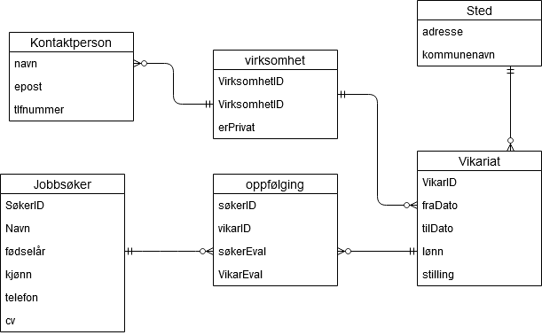
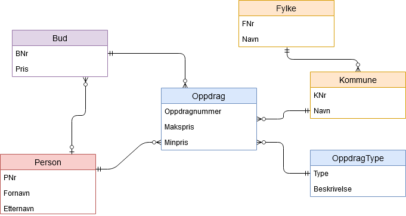

Gjennomgang av tidligere eksamener
===
- [Eksamen 2016](#Eksamen-2016)
- [Eksamen 2018](#Eksamen-2018)
- [Eksamen 2019](#Eksamen-2019)
  
# Eksamen 2016
## Oppgave 1
### a)
``` SQL
SELECT KundeNr, RegNr FROM Forsikring
WHERE ForsType = "Kasko" 
AND KmPrAar > 20000
ORDER BY KundeNr;
```

### b)
``` SQL
SELECT Forstype AS Forsikringstype, count(*) AS Antall FROM Forsikring;
```

### c)
``` SQL
SELECT ForsNr, count(SaksNr) FROM Forsikring LEFT OUTER JOIN Skadesak
ON Forsikring.ForsNr = Skadesak.ForsNr;
```

### d)
``` SQL
CREATE TABLE Forsikring(
    ForsNr      INTEGER NOT NULL,
    KundeNr     INTEGER NOT NULL,
    RegNr       VARCHAR NOT NULL,
    KmPrAar     INTEGER NOT NULL,
    ForsType    VARCHAR NOT NULL,
    Bonus       BOOLEAN NOT NULL,
    AarsPremie  DECIMAL NOT NULL,
    CONSTRAINT ForsikringPK PRIMARY KEY (ForsNr),
    CONSTRAINT ForsikringsFK FOREIGN KEY (KundeNr)
        REFERENCES Kunde(KundeNr)
)
```

### e)
``` SQL
INSERT INTO Skadesak(ForsNr, RegDato, SkadeType)
VALUES(2, CURDATE(), "Kollisjon");

UPDATE Forsikring
SET Bonus = Bonus-10
WHERE ForsNr = 2;
```

## Oppgave 2
``` 
jobbsøker(SøkerID, navn, fødselsår, kjønn, telefon, CV)
Vikariat(vikarID, fraDato, tilDato, lønn, stilling)
Sted(gateaddresse, kommunenavn)
kontaktperson(navn, epost, tlfnummer)
virksomhet(virksomhetID, erprivat)
oppfølging(SøkerID, vikarID, søkerEval, VikarEval)
```


## Oppgave 3
### a)
$πKundeNr(σSkadeT ype=′T yveri′,F orsT ype=′Kasko′(Skadesak⊗Skadesak.F orsNr=F orsikring.F orsNrForsikring))$

``` SQL
SELECT KundeNR FROM Skadesak, Forsikring
    WHERE Skadesak.ForsNr = Forsikring.ForsNr
    AND SkadeType="Tyveri"
    AND ForsType="Kasko";
```

### b)
$π KundeNr (σ SkadeType="Tyveri",ForsType="Kasko" (Skadesak⊗Skadesak.ForsNr=Forsikring.ForsNr Forsikring))$

Min versjon:

$π KundeNr (σ SkadeType="Tyveri" (σ ForsType="Kasko" (Skadesak⊗ Skadesak.ForsNr = Forsikring.ForsNr Forsikring)))$

### c)

``` 
π KundeNr (σ SkadeType="Tyveri",ForsType="Kasko" (Skadesak⊗Skadesak.ForsNr=Forsikring.ForsNr Forsikring))

π KundeNr
    |
σ SkadeType="Tyveri",ForsType="Kasko" 
    |
⊗ Skadesak.ForsNr = Forsikring.ForsNr
   |        \
   |         \
   |          \
Skadesak, Forsikring
```

```
π KundeNr (σ SkadeType="Tyveri" (σ ForsType="Kasko" (Skadesak⊗ Skadesak.ForsNr = Forsikring.ForsNr Forsikring)))

π KundeNr
    |
σ SkadeType="Tyveri"
    |
σ ForsType="Kasko" 
    |
⊗ Skadesak.ForsNr = Forsikring.ForsNr
   |        \
   |         \
   |          \
Skadesak, Forsikring
```

## Oppgave 4
``` SQL
Kunde(KundeNr, FDato, Fornavn, Etternavn, KoNr, KoNavn, FyNr, FyNavn)
(1, ’1988-07-17’, ’Ola’, ’Hansen’, ’0821’, ’Bø’, ’08’, ’Telemark’)
```

Det som er uheldig med denne tabellen er at informasjon blir lagret flere ganger, også kalt dobbeltlagring (redudans)

**Funksjonelle Avhengigheter:**
- KundeNr &rarr; ALLE KOLONNER
- Fornavn, etternavn &rarr; KundeNr
- KoNavn &rarr; KoNr
- KoNr &rarr; FyNr
- FyNr &rarr; FyNavn

**Kandidatnøkkel:** KundeNr

- Kunde(#KundeNr, FDato, Fornavn, Etternavn, KoNr*)
- Kommune(#KoNr, KoNavn, FyNr*)
- Fylke(#FyNr, FyNavn)

## Oppgave 5
1. Beskriv to regler i regelbasert optimalisering
   1. skyv seleksjon og projeksjoner nedover i treet hvis det er mulig
   2. Bytt om på likekoblinger for å minske størrelsen på mellomresultater
   3. Bryt ned sammensatte seleksjoner i flere enkle.
2. Hva betyr "Tapsfri dekomposisjon" av T til T1 og T2?
   - Å bryte tabellen T opp i to undertabeller, T1 og T2 som kan samles til T uten tap av data
3. Horisontal og Vertikal fragmentering:
   -  Horisontal: Oppbryting av tabell vannrett (rader)
   -  Vertikal: Oppbryting av tabell loddrett (Kolonner)
4. Hva bør vi være obs på hvsi vi bruker vertikal fragmentering?
   -  At primærnøkkelen er til stede i hver fragment
5. Nevn tre krav til et "velformert" XML-dokument
   - Dokumentet har nøyaktig et rotelement
   - Alle elementer har et start og sluttmerke
   - Elementene er riktig nøstet
6. Hvorfor stiller vi disse kravene til XML?
   - Kravene sikrer at vi kan representere XML-dokumenter som et tre

## Oppgave 6
1. Hvor mange biter trenger vi for å representere tre heksadesimale tall?
   - Vi trenger 12biter (1 hex = 4 bit)
2. Hvilke uttrykk betyr det samme som (KmPrAar >=5000) AND (RegAar < 2000)?
   - NOT((KmPrAar <5000) OR (RegAar >=2000))
3. Hvilken tekst passer med (matcher) mønsteret "_a%b"?
   - baab
4. Hva er kravene til en fremmednøkkel?
   - Den må enten være null, eller inneholde en verdi som finnes i tilhørende primærnøkkel
5. Hva blir resultatet av spørringen
``` SQL
SELECT MAX(Bonus) FROM Forsikring 
WHERE ForsType='Kasko'?

    - En kolonne med 50
```
   
6. Hvor mange rader gir spørringen 
```SQL
SELECT * FROM skadesak, Forsikring 
WHERE Skadesak.ForsNr = Forsikring.ForsNr?

    - 5
```

7. Hvor mange rader gir spørringen?
```SQL
SELECT * FROM Skadesak RIGHT OUTER JOIN Forsikring ON Skadesak.ForsNr = Forsikring.ForsNr?
   
   - 6
```
8. Hvordan blir et en-til-mange forhold mellom entitetene A og B (Kråkefot ved B) representert i databasen?
   - Det blir lagt til en fremmednøkkel i B
9. Hva er en svak entitet?
   - En entitet som arver idnetifikator (primærnøkkel) fra en annen entitet
11. Hva menes med at PHP brukes til å lage dynamiske nettsider?
    - Nettsidene blir generert av et program for hver forespørsel


# Eksamen 2018
## Oppgave 1
### a)
``` SQL 
SELECT * FROM Tur 
WHERE Pris < 8000
AND MONTH(StartDato) = 7;
```

### b)
``` SQL
SELECT * FROM Medlem, Påmelding, Tur
WHERE Medlem.MNr = Påmelding.MNr
AND Påmelding.TNr = Tur.Tnr
AND Tur.StartHytte = 2;
```
### c)
``` SQL
SELECT TNr, Beskrivelse, StartDato, count(*) FROM Tur
WHERE Tur.TNR = Påmelding.TNr
GROUP BY Tur.TNr;
```

### d)
``` SQL
CREATE TABLE Hytte(
    HNr INT AUTO_INCREMENT,
    Navn VARCHAR NOT NULL,
    AntSenger INT,
    HytteType VARCHAR,
    CONSTRAINT HyttePK PRIMARY KEY (HNr)
)
```

### e)
``` SQL
INSERT INTO Medlem(Fornavn, Etternavn, TLF)
VALUES("Ola", "Nordmann", "81520030");

INSERT INTO Påmelding(TNr, MNr)
VALUES(3, LAST_INSERT_ID());
```

### f)
``` SQL
SELECT * FROM Medlem
WHERE Medlem.MNr NOT IN(SELECT MNr FROM Påmelding);
```

## Oppgave 2
``` 
person(PNr, Fornavn, Etternavn, e-post, passord)
oppdrag(Oppdragnummer, makspris, minpris)
oppdragType(Type, beskrivelse)
bud(BNr, Pris)
kommune(KNr, Navn)
fylke(FNr, Navn)
```


## Oppgave 3
### a)
``` SQL
SELECT Pris FROM Hytte, Tur
WHERE HNr=StartHytte
AND HytteType="Selvbetjent" 
AND Beskrivelse="Brevandring";
```

### b)
Original:

$π Pris (σHytteType='Selvbetjent',Beskrivelse='Brevandring' Hytte⊗HNr=StartHytte Tur))$

Min versjon:

$π Pris (σHytteType='Selvbetjent'(σBeskrivelse='Brevandring'(Hytte⊗HNr=StartHytte Tur)))$

### c)
``` 
π Pris
|
σ HytteType='Selvbetjent',Beskrivelse='Brevandring'
|
⊗ HNr=StartHytte
|   \
|    \
|     \
Hytte, Tur
```

```
π Pris 
|
σ HytteType='Selvbetjent'
|
σ Beskrivelse='Brevandring'
|
⊗ HNr=StartHytte
|  \
|   \
|    \
Hytte, Tur
```

## Oppgave 4
``` SQL
TurUtvidet(TNr, Beskrivelse, Pris, Dato, Hytte)
TurUtvidet(1, "Krevende topptur", 7500, "2018-04-28", 1)
```
Hva som er uheldig med denne tabellen:

Den viser repetitiv informasjon, pris og beskrivelse forekommer flere ganger og fører til dobbeltlagring.

**Funksjonelle avhengigheter:**
- TNr &rarr; Beskrivelse
- TNr &rarr; Pris
- TNr+dat &rarr; Hytte

**Kandidatnøkkel:**
- TNr +  Dato

**Normalisering:**
- TurUtvidet(#TNr, Beskrivelse, Pris)
- Beskrivelse(#TNr, Dato*, Hytte)

## Oppgave 5
- Indeks: 
  - En indeks er lik stikkordregisrert i en bok: Den består av søkenøkler og pekere
  - En indeks er en datastruktur som bidrar til å effektivisere søk
  - Kolonner som er med i mange søkebetingelser
  - Kolonner som inngår i koblingsbetingelser, spesielt fremmednøkler.
- Hva er en visning (utsnitt)?
  - En virtuell tabell som kan være skjult for sluttbruker
  - Blir definert som et utvalgsspørring
- Hva er en lås i sammenheng med databaser?
  - Ventemekanisme som blir styrt av en transaksjon
  - Vranglås er når en prosess venter på en annen prosess som venter på den andre (Dining philosophers)
- Fire egenskaper en transaksjon bør ha
  1.  Atomicity
  2.  Consistency
  3.  Isolation
  4.  Durability
- Hvorfor kalles PHP et skriptspråk?
  - Fordi det samhandler med andre programmer
  - produserer deler av programmer
- Hva har "regelbasert optimalisering" og XSLT til felles?
  - Begge jobber med tre strukturer
  - Begge bygger på regler som beskriver transformasjoner av tre strukturer

## Oppgave 6
- baba, aba og abb
  - %ab_
- Fremmednøkkel
  - Den må enten være null, eller inneholde en verdi som finnes i tilhørende primærnøkkel
- ``` SQL
  SELECT MAX(Pris) FROM Tur WHERE StartHytte=1
  ```
  - En kolonne med 4 verdien 6500
- ``` SQL
  SELECT * FROM Tur, Hytte WHERE Tur.StartHytte = Hytte.HNr
  ```
  - 4
- ``` SQL
  SELECT * FROM Medlem LEFT OUTER JOIN Påmelding 
  ON Medlem.MNr = Påmelding.MNr
  ```
  - 8
- Hvordan blir et en-til-mange forhold mellom entitetene A og B replresentert i databasen?
  - Det blir lagt til en fremmednøkkel i B
- Hva er korrekt?
  - En primærnøkkel er også en kandidatnøkkel
- Hva er redundans?
  - Informasjon som blir gjentatt
- Hva er en svak entitet?
  - En entitet som arver identifikator (primærnøkkel) fra en annen entitet
- Hva menes med at PHP brukes til å lage dynamiske nettsider?
  - Nettsidene blir generert av et program for hver forespørsel

# Eksamen 2019
## Oppgave1
### a)
``` SQL
SELECT * FROM ContainerType 
WHERE MaxVekt > 5000 
AND dagpris < 1800;
```

### b)
``` SQL
SELECT * FROM Oppdrag 
WHERE FraDato = "2019-12-17" OR TilDato = "2019-12-19";
```

### c)
``` SQL
SELECT TypeID, TypeNavn, count(*) FROM ContainerType, Container 
WHERE ContainerType.TypeID = Container.TypeID;
```

### d)
``` SQL
CREATE TABLE Oppdrag(
    ONr INT AUTO_INCREMENT,
    Tlf VARCHAR NOT NULL, 
    CNr INT NOT NULL, 
    FraDato DATE NOT NULL,
    TilDato DATE,
    PRIMARY KEY(ONr),
    FOREIGN KEY(Tlf) REFERENCES Kunde(Tlf),
    Foreign key(CNr) REFERENCES Container(CNr));
```

### e)
``` SQL
INSERT INTO Kunde("90190190", "TotallyAnAddress 123");
INSERT INTO Oppdrag(Tlf, CNr, FraDato, TilDato) 
Values("90190190", 1337, "2020-12-12", "2020-12-30");
```

### f)
``` SQL
CREATE VIEW minView(Kunde, Pris) AS SELECT K.Tlf, SUM(*DATEDIFF(TilDato, FraDato)*Dagpris) FROM Kunde AS K, Oppdrag AS O, Container AS C, ContainerType AS T 
WHERE K.Tlf = O.Tlf
AND O.Cnr = C.Cnr
AND C.TypeId = T.TypeId
GROUP BY O.TLF;  
```

## Oppgave2
``` SQL
SKIP(Navn, MaksPass)

Passasjer(Pnr, epost, fornavn, etternavn, kjønn, fødselsdato, tlf)

Pass_has_reserv(pass_pnr, Res_nr, kabin_dekk, kabin_løpnr, kabin_skipnavn, døgnpris)

Reservasjon(Resnr, CruiseNr)

cruise(Cnr, Start_dato, Skip_navn)

kabin(dekknr, løpenr, kat, skip_navn)

kategori(katnr, antall_senger, døgnpris)

opphold(cruise_cnr, havn_hnr, ankomst_dato, avreise_dato)

havn(hnr, bynavn, telefon)
```

## Oppgave3
### a)
``` SQL
SELECT ONr 
FROM Oppdrag, Container 
WHERE Oppdrag.CNr = Container.CNr 
AND Tlf="12341234" 
AND TypeId="2";
```
### b)
$πONr(σTlf="12341234"(σTypeId="2"(Skadesak⊗Oppdrag.CNr=Container.CNrContainer)))$

$πONr(σTlf="12341234"(Oppdrag)⊗Oppdrag.CNr=Container.CNrσTypeId="2"(Container))$

### c)
**Operatortre:**   


## Oppgave4
Hvorfor løsningen er problematisk: 
- Tabellen inneholder informasjon som er unødvendig å vise flere ganger, som ```MaksVekt``` og ```RegAar``` som blir unødvendig å vise i tabellen.

``` SQL
Mitt forslag:

Modell(#Modell, MaxVekt)  
Bil(#RegNr, Modell*, ONr*)   
Aarstall(#RegNr*, RegAar)
```

``` SQL
Løsningsforslag:

Modell(#Modell, MaxVekt)
Bil(#RegNr, RegAar, Modell*)   
Oppdrag(ONr*, RegNr*)   
```

## Oppgave5
1. Regelbasert optimalisering
   1. Skyv seleksjon og projeksjoner nedover i treet hvis det er mulig
   2. Bytt om på likekoblinger for å minske størrelsen på mellomresultater
   3. Bryt ned sammensatte seleksjoner i flere enkle
2. Tapsi dekomposisjon
   1. Natural join vil aldri gi opphav til falske tupler, $2/2=1$ -> $1+1=2$
3. Horisontal og vertikal fragmentering
   1. Horisontal: Bryt opp tabellen vannrett(Rader)
   2. Vertikal: Bryt opp tabellen loddrett(Kolonner)
4. Hva bør vi være obs på ved vertikal fragmentering?
   1. Primærnøkkel må være med i *alle* fragmenteringer
5. Tre krav til "velformet" XML-dokument
   1. Kun *et* rotelement
   2. Alle elementer har et start og sluttmerke
   3. Elementer er nøstet korrekt
6. Vi stiller disse kravene fordi da kan vi representere XML-dokumentet som et tre

## Oppgave6
1. d) "a%b" matcher "abccba"
2. b) Vi velger en kandidatnøkkel som primærnøkkel
3. c) Alle verdier i fremmednøkkelen må finnes i tilhørende primærnøkkel
4. d) 12
5. c) 4
6. a) Skriptet blir utført på web-tjeneren og utdata blir sendt til nettleseren
7. b) vis telefon og antall oppdrag for samtlige kunder, også de uten oppdrag
8. d) Et utsnitt er en virtuell tabell
9. d) Flere transaksjoner kan ha leselås på samme rad samtidig
10. c) Tofaselåsing garanterer serialiserbare forløp

