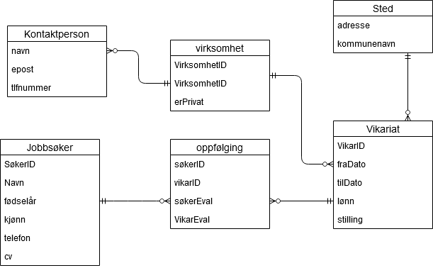

# Eksamen 2016
## Oppgave 1
### a)
``` SQL
SELECT KundeNr, RegNr FROM Forsikring
WHERE ForsType = "Kasko" 
AND KmPrAar > 20000
ORDER BY KundeNr;
```

### b)
``` SQL
SELECT Forstype AS Forsikringstype, count(*) AS Antall FROM Forsikring;
```

### c)
``` SQL
SELECT ForsNr, count(SaksNr) FROM Forsikring LEFT OUTER JOIN Skadesak
ON Forsikring.ForsNr = Skadesak.ForsNr;
```

### d)
``` SQL
CREATE TABLE Forsikring(
    ForsNr      INTEGER NOT NULL,
    KundeNr     INTEGER NOT NULL,
    RegNr       VARCHAR NOT NULL,
    KmPrAar     INTEGER NOT NULL,
    ForsType    VARCHAR NOT NULL,
    Bonus       BOOLEAN NOT NULL,
    AarsPremie  DECIMAL NOT NULL,
    CONSTRAINT ForsikringPK PRIMARY KEY (ForsNr),
    CONSTRAINT ForsikringsFK FOREIGN KEY (KundeNr)
        REFERENCES Kunde(KundeNr)
)
```

### e)
``` SQL
INSERT INTO Skadesak(ForsNr, RegDato, SkadeType)
VALUES(2, CURDATE(), "Kollisjon");

UPDATE Forsikring
SET Bonus = Bonus-10
WHERE ForsNr = 2;
```

## Oppgave 2
``` 
jobbsøker(SøkerID, navn, fødselsår, kjønn, telefon, CV)
Vikariat(vikarID, fraDato, tilDato, lønn, stilling)
Sted(gateaddresse, kommunenavn)
kontaktperson(navn, epost, tlfnummer)
virksomhet(virksomhetID, erprivat)
oppfølging(SøkerID, vikarID, søkerEval, VikarEval)
```


## Oppgave 3
### a)
$πKundeNr(σSkadeT ype=′T yveri′,F orsT ype=′Kasko′(Skadesak⊗Skadesak.F orsNr=F orsikring.F orsNrForsikring))$

``` SQL
SELECT KundeNR FROM Skadesak, Forsikring
    WHERE Skadesak.ForsNr = Forsikring.ForsNr
    AND SkadeType="Tyveri"
    AND ForsType="Kasko";
```

### b)
$π KundeNr (σ SkadeType="Tyveri",ForsType="Kasko" (Skadesak⊗Skadesak.ForsNr=Forsikring.ForsNr Forsikring))$

Min versjon:

$π KundeNr (σ SkadeType="Tyveri" (σ ForsType="Kasko" (Skadesak⊗ Skadesak.ForsNr = Forsikring.ForsNr Forsikring)))$

### c)

``` 
π KundeNr (σ SkadeType="Tyveri",ForsType="Kasko" (Skadesak⊗Skadesak.ForsNr=Forsikring.ForsNr Forsikring))

π KundeNr
    |
σ SkadeType="Tyveri",ForsType="Kasko" 
    |
⊗ Skadesak.ForsNr = Forsikring.ForsNr
   |        \
   |         \
   |          \
Skadesak, Forsikring
```

```
π KundeNr (σ SkadeType="Tyveri" (σ ForsType="Kasko" (Skadesak⊗ Skadesak.ForsNr = Forsikring.ForsNr Forsikring)))

π KundeNr
    |
σ SkadeType="Tyveri"
    |
σ ForsType="Kasko" 
    |
⊗ Skadesak.ForsNr = Forsikring.ForsNr
   |        \
   |         \
   |          \
Skadesak, Forsikring
```

## Oppgave 4
``` SQL
Kunde(KundeNr, FDato, Fornavn, Etternavn, KoNr, KoNavn, FyNr, FyNavn)
(1, ’1988-07-17’, ’Ola’, ’Hansen’, ’0821’, ’Bø’, ’08’, ’Telemark’)
```

Det som er uheldig med denne tabellen er at informasjon blir lagret flere ganger, også kalt dobbeltlagring (redudans)

**Funksjonelle Avhengigheter:**
- KundeNr &rarr; ALLE KOLONNER
- Fornavn, etternavn &rarr; KundeNr
- KoNavn &rarr; KoNr
- KoNr &rarr; FyNr
- FyNr &rarr; FyNavn

**Kandidatnøkkel:** KundeNr

- Kunde(#KundeNr, FDato, Fornavn, Etternavn, KoNr*)
- Kommune(#KoNr, KoNavn, FyNr*)
- Fylke(#FyNr, FyNavn)

## Oppgave 5
1. Beskriv to regler i regelbasert optimalisering
   1. skyv seleksjon og projeksjoner nedover i treet hvis det er mulig
   2. Bytt om på likekoblinger for å minske størrelsen på mellomresultater
   3. Bryt ned sammensatte seleksjoner i flere enkle.
2. Hva betyr "Tapsfri dekomposisjon" av T til T1 og T2?
   - Å bryte tabellen T opp i to undertabeller, T1 og T2 som kan samles til T uten tap av data
3. Horisontal og Vertikal fragmentering:
   -  Horisontal: Oppbryting av tabell vannrett (rader)
   -  Vertikal: Oppbryting av tabell loddrett (Kolonner)
4. Hva bør vi være obs på hvsi vi bruker vertikal fragmentering?
   -  At primærnøkkelen er til stede i hver fragment
5. Nevn tre krav til et "velformert" XML-dokument
   - Dokumentet har nøyaktig et rotelement
   - Alle elementer har et start og sluttmerke
   - Elementene er riktig nøstet
6. Hvorfor stiller vi disse kravene til XML?
   - Kravene sikrer at vi kan representere XML-dokumenter som et tre

## Oppgave 6
1. Hvor mange biter trenger vi for å representere tre heksadesimale tall?
   - Vi trenger 12biter (1 hex = 4 bit)
2. Hvilke uttrykk betyr det samme som (KmPrAar >=5000) AND (RegAar < 2000)?
   - NOT((KmPrAar <5000) OR (RegAar >=2000))
3. Hvilken tekst passer med (matcher) mønsteret "_a%b"?
   - baab
4. Hva er kravene til en fremmednøkkel?
   - Den må enten være null, eller inneholde en verdi som finnes i tilhørende primærnøkkel
5. Hva blir resultatet av spørringen
``` SQL
SELECT MAX(Bonus) FROM Forsikring 
WHERE ForsType='Kasko'?

    - En kolonne med 50
```
   
6. Hvor mange rader gir spørringen 
```SQL
SELECT * FROM skadesak, Forsikring 
WHERE Skadesak.ForsNr = Forsikring.ForsNr?

    - 5
```

7. Hvor mange rader gir spørringen?
```SQL
SELECT * FROM Skadesak RIGHT OUTER JOIN Forsikring ON Skadesak.ForsNr = Forsikring.ForsNr?
   
   - 6
```
8. Hvordan blir et en-til-mange forhold mellom entitetene A og B (Kråkefot ved B) representert i databasen?
   - Det blir lagt til en fremmednøkkel i B
9. Hva er en svak entitet?
   - En entitet som arver idnetifikator (primærnøkkel) fra en annen entitet
11. Hva menes med at PHP brukes til å lage dynamiske nettsider?
    - Nettsidene blir generert av et program for hver forespørsel
