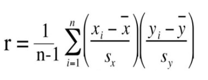
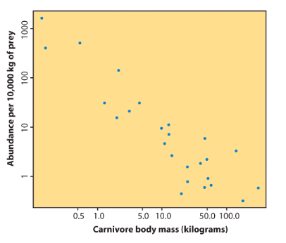
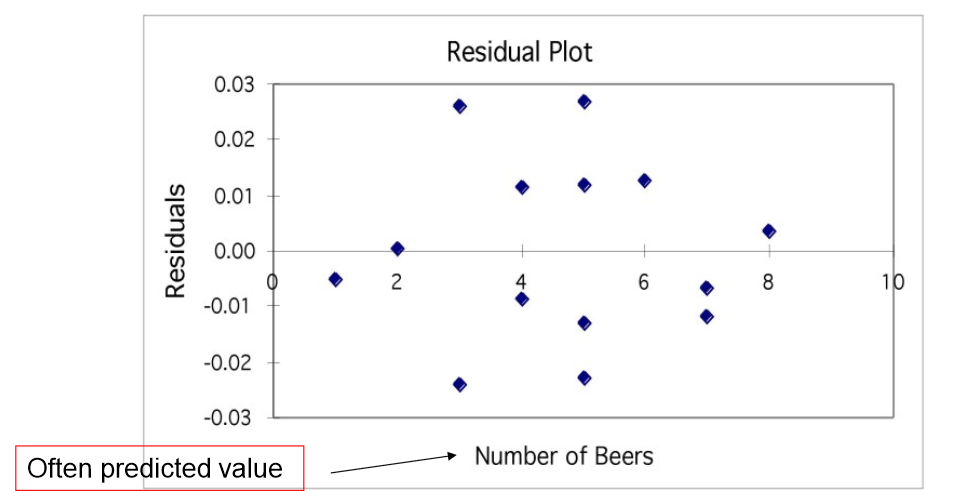
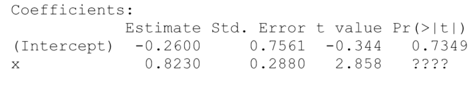

# Stat101 Notater

- # Spredningsplott:
  - Form: Lineær, ikke-lineær, ingen sammenheng
    - Positiv sammenheng:
      - større verdier på x = større verdier på y
    - Negativ sammenheng:
      - store Y'er med små x'er (og motsatt)
  - Retning: positiv, negativ
  - Styrke: hvor tett punktene følger "formen"
  - Uteliggere
    - ikke uteligger hvis punkt ligger på samme "retning" 
  

- ## Korrelasjon - mål på grad av lineær samvariasjon
  - korrelasjon koeffisient "r"
  - r ser bort ifra x og y
  - r har ingen prefix (ikke noe navn etc, kun verdi)
  - går fra -1 til +1  
  - korrelasjonskoeffisienten er et mål på retning og styrke av et forhold, kalkulert med **standardavvik** og **gjennomsnitt** av både **x** og **y**   
</img>

- # Minste kvadratsums regresjon (/metode)
  - Regresjonslinje
  - Prediksjon
  - "r i annen"
  
  - **Korrelasjon** beskriver graden av (linær) sammenheng mellom to variabler
    - sier ingenting om 'retning' på sammenhengen. dvs:
      - X -> Y eller Y -> X
  - **Regresjon:** Vi antar at det er X som påvirker Y:
    - Modell:       y = a + bx + "målefeil"
      - x = foklaringsvariabel  =   Vekt kjøtteter
      - y = respons             =   Antall  
</img>

  - **Metode:** formler for "a" og "b"
  - $min_a,_b\sum (y_i-(a+bx_i)) = \sum(error_i)^2$
  - Først finner vi **stigningstallet;**
    - $b=r\frac{S_y}{S_x}$
      - r er korrelasjon
      - $S_y$ er standardavviket til responsen y
      - $S_x$ er standardavviket til forklaringsvariablen x
  - Når vi kjennr b kan vi regne ut a, **skjæringspunktet med y-aksen:**
    - $a=\overline{y}-b\overline{x}$
      - $\overline{x} og \overline{y}$ er gjennomsnitt av x og y variablene
  - Korrelasjonen r (uten fortegn) måler hvor godt x forklarer y
  - Vi kan være litt mere spesifikke: $r^2$ måler hvor mye av <u>variasjonen i y</u> som skydles <u>variasjon i x</u>

  - Transformasjoner av data (x og y) kan være nødvendig

- # Residualplott
  - **Residual = ("Det som blir igjen")**
    - = avstanden mellom observert og predikert verdi
    - Residualen er avstanden mellom y-observert og y-predikert. Vi plotter dem i et residualplott
    - Dersom data er tilfeldig spredt rundt 0 er antakelsen om en lineær modell mest trolig OK, og du hadde neppe uteliggere   

      

    - Formuler regresjonsmodellen over og bruk S-Plus utskriften til å finne parameterestimater.
      - **Fasit:**
        - Regresjonsmodellen y = a + bx + z der z er et normalfordelt feilled med standardavvik $\sigma$. Parameterestimater: $a=-0.26, b = 0.823$ og $\sigma=3.34$

- # Terminology
  - Individene i et eksperiment er **eksperimentelle enheter**
    - Om de er mennesker, kalles de **subjects**
  - I et eksperiment gjør vi noe til noen, *noe* i dette tilfellet kalles ***treatment*** eller en ***faktor***
      - En faktor kan være at vi gir en medisin
        - Gir vi to forskjellige doser til individene, testes to **nivåer**
        - Effekten av en faktor er **statistisk signifikant** hvis den er større en det en kan vente seg på grunn av tilfeldighet
    - Bias = skjevhet
      - skjevhet hvis et enderesultat er *favorisert*
      - **Fisher's solution:**
        - "randomized comaparative experiments"
          - Gi medisin til tilfeldige utvalgte, og ikke bland de utvalgt før resultatet skal presenteres. På den måten vil resultatet ikke bli 'skrudd' opp eller ned mtp. de rundt deg
- ## Empirisk varians
  - $s^2=\frac{1}{n-1}[(x_1-\overline{x})^2+(x_2-\overline{x})^2+...]=\frac{1}{n-1}\sum(x_i-\overline{x})^2$

- ## Empirisk Standardavvik
  - $s=\sqrt{\frac{1}{n-1}\sum(x_i-\overline{x})^2}$

- ### Sannsynlighet for en 2-barnsfamilie har 2 gutter?
  - Utfallsrommet: U = {GG, GJ, JG, JJ} og hendelsen A = {GG} gir $P(A)=\frac{n_A}{n_U}=\frac{g}{m}=\frac{1}{4}$

- ### på en videregående skole er det 20 lærere hvorav 12 er kvinner, rektoren har utnevnt et lærerutvalg som skal undersøke trivsel på skolen blant elevene. Sannsynligheten for at personen er med i utvalget gitt t det er en kvinne er 50% mens tilsvarende for menn er 25%. 
  - K = personen er en kvinne
  - M = personen er en mann
  - U = personen er i utvalget
    1. Sett opp sannsynlighetene P(K), P(M), P(U|K) og P(U|M)
    2. Finn sannsynligheten for at en tilfeldig ærer er i utvalget
    3. finn sannsynligheten for at etm edlem av utvalget er en kvinne
    4. Finn sannsynligheten for at en lærer som ikke er i utvalget er en mann

- ### Svar:
  - 1:
      - $P(K)=\frac{12}{20}=0.60 = 60\%$
      - $P(M)=1-P(K)=0.40=40\%$
      - $P(U|K)=50\%$
      - $P(U|M)=25\%$
  - 2:
    - $P(U)=P(U|K)*P(K)+P(U|M)*P(M)=0.50*0.60+0.25*0.4=0.4=40\%$  
  
    

## Diskrete fordelinger
### Binomisk fordeling 
$E=(X)=np$

$Var(X)=np(1-p)$

$P(X=x)=(\frac{n}{x})p^x(1-p)^{n-x}$